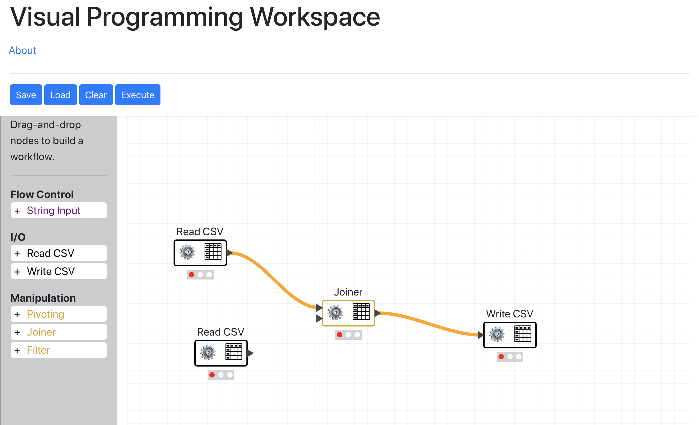

# PyWorkflow
|            |        |
|------------|--------|
| Docker     | TBD    |
| Back-end   |  |
| Front-end  | TBD |
| PyWorkflow |  |
| CLI        | TBD |
| Jest       | TBD |  

PyWorkflow is a visual programming application for building data science
pipelines and workflows. It is inspired by [KNIME](https://www.knime.com)
and aims to bring the desktop-based experience to a web-based environment.
PyWorkflow takes a Python-first approach and leverages the power of *pandas*
DataFrames to bring data-science to the masses.



# Introduction
PyWorkflow was developed with a few key principles in mind:

1) Easily deployed. PyWorkflow can be deployed locally or remotely with pre-built
Docker containers.

2) Highly extensible. PyWorkflow has a few key nodes built-in to perform common
operations, but it is built with custom nodes in mind. Any user can write a 
custom node of their own to perform *pandas* operations, or other data science
packages. 

3) Advanced features for everyone. PyWorkflow is meant to cater to users with
no programming experience, all the way to someone who writes Python code daily.
An easy-to-use command line interface allows for batch workflow execution and
scheduled runs with a tool like `cron`.

To meet these principles, the user interface is built on
[react-diagrams](https://github.com/projectstorm/react-diagrams)
to enable drag-and-drop nodes and edge creation. These packaged nodes provide
basic *pandas* functionality and easy customization options for users to create
workflows tailored to their specific needs. For users looking to create custom
nodes, please [reference the documentation on how to write your own class](docs/custom_nodes.md). 

On the back-end, a computational graph stores the nodes, edges, and
configuration options using the [NetworkX package](https://networkx.github.io).
All data operations are saved in JSON format which allows for easy readability
and transfer of data to other environments.  

# Getting Started
The back-end consists of the PyWorkflow package, to perform all graph-based
operations, file storage/retrieval, and execution. These methods are triggered
either via API calls from the Django web-server, or from the CLI application.

The front-end is a SPA React app (bootstrapped with create-react-app). For React
to request data from Django, the `proxy` field is set in `front-end/package.json`,
telling the dev server to fetch non-static data from `localhost:8000` **where
the Django app must be running**.

## Docker

The easiest way to get started is by deploying both Docker containers on your
local machine. For help installing Docker, [reference the documentation for your
specific system](https://docs.docker.com/get-docker/).

The Docker container for PyWorkflow is built from 2 images: the `front-end` and
the `back-end`. The `docker-compose.yml` defines how to combine and run the two.

In order to build each image individually, from the root of the application:
- `docker build front-end --tag FE_IMAGE[:TAG]`
- `docker build back-end --tag BE_IMAGE[:TAG]`
  ex. - `docker build back-end --tag backendtest:2.0`

Each individual image can be run by changing to the `front-end` or `back-end` directory and running:
- `docker run -p 3000:3000 --name FE_CONTAINER_NAME FE_IMAGE[:TAG]`
- `docker run -p 8000:8000 --name BE_CONTAINER_NAME BE_IMAGE[:TAG]`
  ex. - `docker run -p 8000:8000 --name pyworkflow-be backendtest:2.0`

Note: there [is a known issue with `react-scripts` v3.4.1](https://github.com/facebook/create-react-app/issues/8688)
that may cause the front-end container to exit with code 0. If this happens,
you can add `-e CI=true` to the `docker-run` command above for the front-end.

To compose and run the entire application container, from the root of the application:
- `docker-compose up`

You can then kill the container gracefully with:
- `docker-compose down`

NOTE: For development, change ./front-end/package.json from "proxy": "http://back-end:8000" to "http://localhost:8000" to work.


## Serve locally

Alternatively, the front- and back-ends can be compiled separately and run on
your local machine. 

### Server (Django)

1. Install `pipenv`

- **Homebrew**
       
```
brew install pipenv
```
       
- **pip**
    
```
pip install pipenv OR pip3 install pipenv
```        
2. Install dependencies
Go to the `back-end` directory with `Pipfile` and `Pipfile.lock`.
```
cd back-end
pipenv install
```
3. Setup your local environment

- Create environment file with app secret 
```
echo "SECRET_KEY='TEMPORARY SECRET KEY'" > vp/.environment
```

4. Start dev server from app root
```
cd vp
pipenv run python3 manage.py runserver
```
    
If you have trouble running commands individually, you can also enter the
virtual environment created by `pipenv` by running `pipenv shell`.

### Client (react-diagrams)
In a separate terminal window, perform the following steps to start the
front-end.

1. Install Prerequisites
```
cd front-end
npm install
```
2. Start dev server
```
npm start
```

# CLI
PyWorkflow also provides a command-line interface to execute pre-built workflows
without the client or server running. The CLI is packaged in the `back-end`
directory and can be accessed through a deployed Docker container, or locally
through the `pipenv shell`. 

The CLI syntax for PyWorkflow is:
```
pyworkflow execute workflow-file...
```

For help reading from stdin, writing to stdout, batch-processing, and more
[check out the CLI docs](docs/cli.md) for more information.

# Tests
PyWorkflow has several automated tests that are run on each push to the GitHub
repository through GitHub Actions. The status of each can be seen in the various
badges at the top of this README.

PyWorkflow currently has unit tests for both the back-end (the PyWorkflow
package) and the front-end (react-diagrams). There are also API tests
using Postman to test the integration between the front- and back-ends. For more
information on these tests, and how to run them, [read the documentation for more
information](docs/tests.md). 
